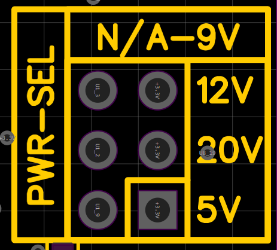

# Overview

Date: April 4, 2026

ProtoDuck is a microcontroller designed from the ground up to overcome the many problems faced by tinkerers, makers, and builders who try their best to ideate and pour their heart into their hardware project for it to not work as expected or unknowingly damaging it.

It is created while keeping these problems in mind:

1. Complexity of Code Uploading and size issues with improper guidance to fix them
2. Accidentally Shorting the board and damaging it
3. Old hardware including most microcontrollers supporting a non-conventional USB input port
4. Lack of GPIO pins while working on big projects and relying on another microcontroller for more pins using RX and TX
5. Lack of firmware updates that could help improve their potential
6. And many more…

Basically what I’m indicating is that the current commonly available microcontrollers are not that great for basic prototyping, not great for people who are starting their journey to a new field.

---

# 1. Power and Protection

A microcontroller is a basic device that requires merely about 3.3V to stably work and sometimes even 1.1V! But there are other factors we need to account for while building the board, how will it be used? What things are going to be connected to it? How much power should be drawn?

For this we provide the user itself the option to choose how much power they want depending on their use case. We have provided a 2x3 pin header on which the user can connect a jumper connector to select their output, we are not stepping up the voltage on board but utilizing the sheer power of the source provided to us, we communicate with the power source for the selected power if available then we pass it through more safety measures and expose it via 3 female headers on board marked as `VBUS_PROT` 

Power selection headers

Requested power output

## 1.1 Static Charge Protection

A major cause of boards getting fried are static charges that the user unknowingly provides to the board, to prevent it we have added a small TVS diode that absorbs any static charges

Schematic Diagram of TVS Diode

## 1.2 Overload Protection

There may be times the user may attach a motor to a 3.3V pin and draw too much power resulting in overheating of the board and eventually the board is dead. The `TPS259271DRCR` chip from Texas Instruments acts as an eFuse and gets tripped when too much power is drawn, it acts as the major protection feature of the board, after it gets tripped a `Red` colored LED turns on and the buzzer beeps indicating to the user that something went wrong and cuts off the power to the microcontrollers, this stays like this until the user unplugs and replugs the board indicating that the user has properly acknowledged the issue and fixed it

Schematic Diagram of eFuse Chip

## 1.3 Power Step Down

The whole board majorly works on a steady 3.3V power instead of the *standardly assumed 5V* so the power needs to be stepped down this is where the role of `TPS54302DDCR_C311983`  chip by Texas instruments comes to play and steps down the voltage to a sweet 3.3V

Schematic Diagram of Voltage Regulator

---

# 2. Computing and Wireless Communication

In the current age wireless communication systems have become an essential part of our lives including WiFi and Bluetooth. We have chosen the newly released `RP2350B` chip by Raspberry Pi Foundation which is a beast in terms of GPIO pins and computational power with an `ARM` based dual-core CPU, but this chip doesn’t have any means for wireless communication? Here I fell into a dilemma of whether to add my own WiFi and Bluetooth Chip (Adding additional burden) or try to find a package that has everything in it. To fix that we also added the newly released `ESP32-C6` chip that is a beast in wireless communication with Bluetooth, WiFi and Zigbee too! Both the chips communicate over their RX and TX lines

ESP32-C6 Schematic Diagram

RP2350B Schematic Diagram

I will be developing a Hardware Abstraction Layer that will run with a RTOS on the RP chip that extracts all the functions and classes from the ESP chip and exposes it to the user code without the need of importing additional libraries, both the RTOS and HAL will consume one core of the ARM chips on both the chips and each chip has been reserved functions and they are independent systems that work in harmony

---

# 3. Storage and Backup

This stage threw me into a puzzle of how many Flash Memory Chips do I need to add on board? The goals that I was trying to achieve was:

1. Separation of the user code from the system code
2. Backup of the firmware of both systems in case of failure

I finally landed on a 3 chip architecture:

1. `USR_FC1` : This contains all the code uploaded by the user
2. `RP_FC2` : This contains the firmware for the RP chip and is properly partitioned to be an A/B partitioned system for updating and proper functioning
3. `BC_FC2` : This contains firmware of both the chips compressed into 2 different partitions

<aside>
💡

Note: All the chips are of 128Mbit

</aside>

This architecture opens many doors for OTA updates and firmware flashing and recovery

---

# 4. Interactive Elements

After adding all the major things on board, I needed to visualize how the board would look and how I envision it to be. After careful consideration, I decided to follow this:

| Type | No. of Pins | Function |
| --- | --- | --- |
| Digital Pins (Programmable) (Female) | 21 | Can be used as regular digital pins or as I2C or anything else! There are endless possibilities! |
| Analog Pins (Female) | 8 | Read analog inputs |
| I2C Header (Female) | 1 | Plug n Play enabling the board for attaching a display or something else |
| Buzzer | 1 | Notification to the user or an asset to the user reducing the need for a speaker or tweeter |
| RGB LED | 1  | To indicate the system status to the user |
| Serial Debugging Headers (Male) | 1 | Debugging and seeing what is causing the error on chip (Advanced debugging) |
| `RST` Tactile Switch | 1 | To reset the board |
| `USR_FLS` Tactile Switch | 1 | To expose the user flash chip to the user PC as a virtual drive |
| Power Selection Headers (Male) | 1 | To select the required power |
| Red LED (Fault Indicator) | 1 | To indicate any power fault |

---

# 5. Project Vision

I envision the microcontroller to be properly controllable by the PC and ease of use, for that I will build a WinUI3 & C# powered app that will control and handle all the major things like board drivers and firmware updates and also the user will be able to beautifully see the reading on the board without the need of adding print statements and finding the reading in the output, over the app the user will also be able to flash their custom firmware that they can develop and flash but a warning will be shown to warn the user about the potential risks and also the user will also be able to reflash the entire board using the official firmware or recover the board using the backup chips all over the app and the user can upload their code over the app and monitor it beautifully, it will show live updates of device metrics and storage information along with sensor information.

I also plan to create an additional library for the user code that will allow the board to share its computational power load to the connected PC for more powerful computation. This will open endless possibilities that will only be limited by the user’s imagination!

Also this project is going to be open source, so it will be properly maintained and bugs will be near zero! I hope for the future developers to keep this sprit going on!

Adios!